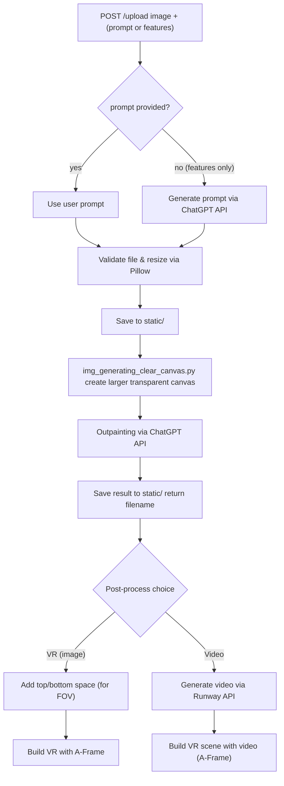

# RE:mind 🎗️ - FLASHBACK
**생성형 AI 기반 사진 확장(Outpainting) + VR 기술을 융합한 우울증 치료·예방 프로그램**

---

## 📌 프로젝트 개요
우울증은 전 세계적으로 3억 명 이상이 겪고 있으며, 기존의 약물치료·상담치료는 부작용, 장기간 치료, 비용 문제 등으로 접근성이 낮습니다.  
본 프로젝트는 **긍정적 기억의 회상 효과**를 기반으로, **AI와 VR을 활용하여 우울증 치료와 예방을 지원하는 새로운 접근 방식**을 제안합니다.

- 📷 **AI Outpainting** : 사용자가 업로드한 사진을 AI가 확장하여 더 넓은 장면을 생성  
- 🕶️ **VR 체험** : 확장된 이미지를 A-Frame VR 환경에서 경험
- 🎵 **AI 음악 생성 (Suno)** : 감정 맞춤 음악을 생성해 치료적 몰입 강화  
- 🎬 **AI 영상 생성 (Runway)** : 확장된 이미지와 음악을 결합해 짧은 영상 제작 가능  
- 🎯 **목표** : 정서 환기, 긍정적 경험 강화, 우울증 예방 및 치료 보조

---

## 🛠️ Tech Stack

### 🖥️ Languages

### ⚙️ Frameworks & Libraries

---

## ⚡ 작동 알고리즘 (Workflow)

1) **입력 수집 (POST)**
   - 사용자가 **사진**과 함께 **prompt** 또는 **특징(feature)** 을 제출.
   - 특징만 받은 경우, **ChatGPT API**로 특징을 바탕으로 **prompt 자동 생성**.

2) **이미지 검증 & 전처리**
   - 업로드된 파일 형식/크기 검증.
   - **Pillow**로 **해상도 조정** 및 기본 정규화.
   - 전처리된 이미지를 **`static/` 폴더**에 저장.

3) **확장 캔버스 생성**
   - `img_generating_clear_canvas.py` 실행 → **투명 캔버스를 포함한 더 큰 해상도**의 이미지로 변환(확장용 캔버스 마련).

4) **Outpainting**
   - 변환된 이미지를 **ChatGPT API 기반 Outpainting**으로 확장.
   - 결과 이미지를 **`static/` 폴더**에 저장하고 **파일명 반환**.

5) **후처리 분기 (사용자 선택)**
   - 반환된 파일명을 바탕으로 결과 이미지를 로드하고,
   - **① 스토리보드 추가하여 “영상화”** 할지,
   - **② 이미지 기반 “VR 환경”** 을 만들지 선택 받음.

6-A) **VR 환경 생성 (이미지)**
   - 단순 VR 선택 시, 결과 이미지의 **위/아래 공간을 생성**(시야 보정).
   - **A-Frame**으로 **브라우저 기반 VR 환경** 구성.

6-B) **영상화 + VR**
   - “영상화” 선택 시, **Runway API**로 결과 이미지(+스토리보드)를 **동영상 생성**.
   - 생성된 영상을 **A-Frame**에 배치해 **VR 시청 환경**으로 제공.

---

### 🗺️ Mermaid Flow

---
## 📌 향후 개선 계획
- 📱 모바일 앱 전환 (웹→앱 변환 시스템 활용)  
- 🔧 Outpainting 결과물 자연스러움 개선 (세분화 Inpainting 알고리즘 적용)  

---

## 📚 관련 논문  
  - *The Effects of Positive Autobiographical Memory Recall in Repairing Sad Mood for Depressed Individuals*  
  - *The Role of Positive Emotion and Contributions of Positive Psychology in Depression Treatment*  

---
